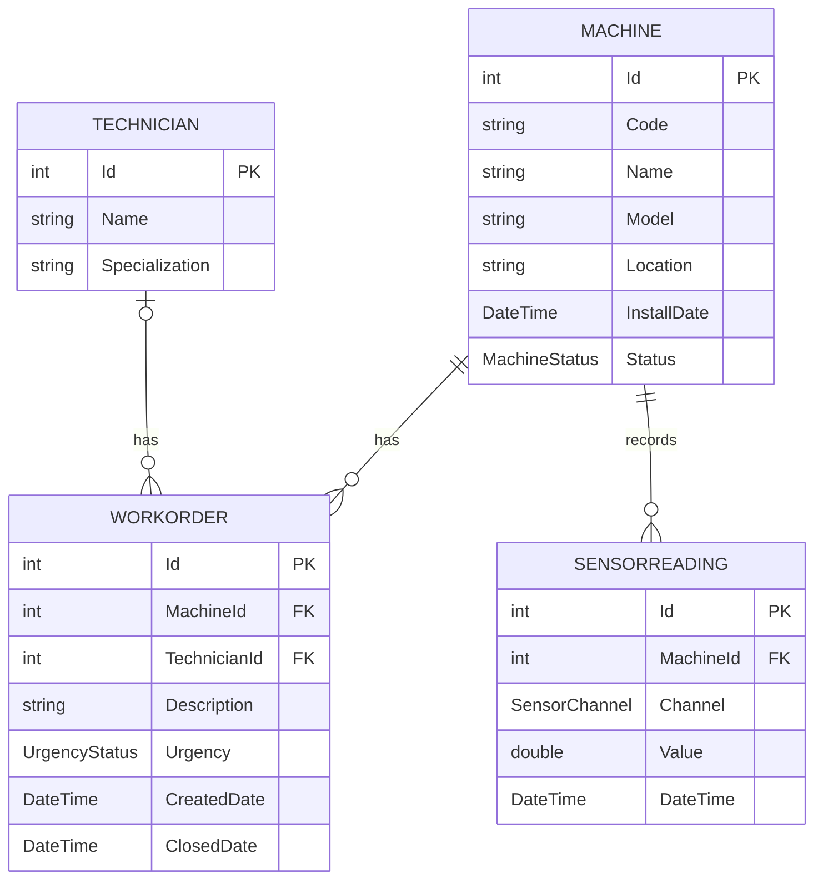

# FMMS — Database ER Diagram

```mermaid
erDiagram
    MACHINE    ||--o{ WORKORDER : has
    TECHNICIAN |o--o{ WORKORDER : has
    MACHINE ||--o{ SENSORREADING : records

    MACHINE {
        int Id PK
        string Code
        string Name
        string Model
        string Location
        DateTime InstallDate
        MachineStatus Status
    }
    TECHNICIAN {
        int Id PK
        string Name
        string Specialization
    }
    WORKORDER {
        int Id PK
        int MachineId FK
        int TechnicianId FK
        string Description
        UrgencyStatus Urgency
        DateTime CreatedDate
        DateTime ClosedDate
    }
    SENSORREADING {
        int Id PK
        int MachineId FK
        SensorChannel Channel
        double Value
        DateTime DateTime
    }
```